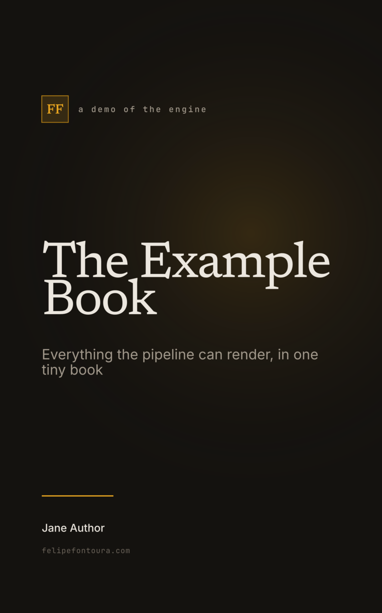
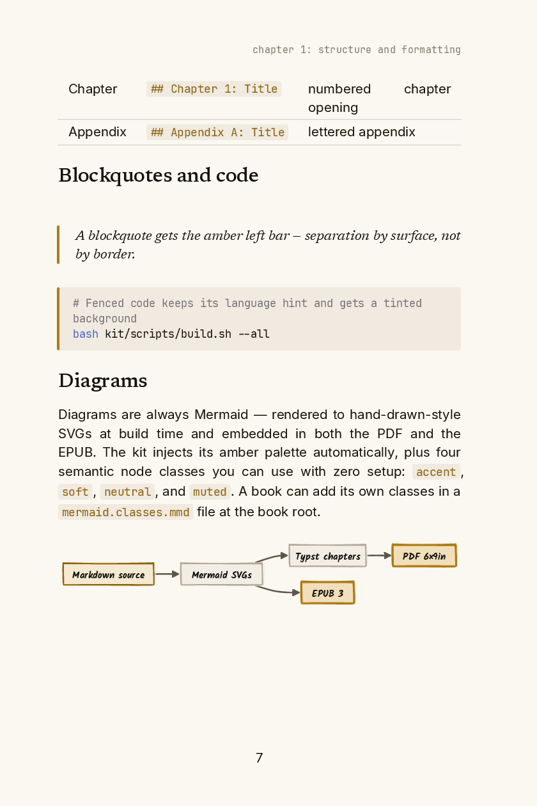

<a id="readme-top"></a>

<div align="center">

# book-kit

**Write a book in Markdown. Get a print-ready PDF, an EPUB 3, a static HTML site, and a KDP cover.**

A portable Typst build engine with editorial print typography, hand-drawn
Mermaid diagrams, LaTeX math, and diagnostic worksheets — shared across many
books as a git submodule.

[](https://github.com/felipefontoura/book-kit/actions/workflows/ci.yml)
[](LICENSE)
[](https://typst.app)
[](https://nodejs.org)

[View sample PDF](example/output/book-en.pdf)
·
[View sample EPUB](example/output/book-en.epub)
·
[Report Bug](https://github.com/felipefontoura/book-kit/issues/new?template=bug_report.yml)
·
[Request Feature](https://github.com/felipefontoura/book-kit/issues/new?template=feature_request.yml)

&nbsp;&nbsp;


*Both images are real, unretouched output of `bash example/run.sh`.*

</div>

## Table of contents

- [About](#about)
- [Getting started](#getting-started)
- [Writing a book](#writing-a-book)
- [Configuration — book.config.json](#configuration--bookconfigjson)
- [Diagrams](#diagrams)
- [Math](#math)
- [Worksheets](#worksheets)
- [Front-matter pages](#front-matter-pages)
- [Architecture](#architecture)
- [Visual system](#visual-system)
- [Roadmap](#roadmap)
- [Contributing](#contributing)
- [License](#license)
- [Contact](#contact)
- [Acknowledgments](#acknowledgments)

## About

Word processors fight you; LaTeX overwhelms you; most Markdown-to-book tools
stop at "it compiles." This kit was built to publish real books and cares about the part those tools skip: **the typography**.

One Markdown file per book is the single source of truth. From it, one command
produces:

- **Print-ready PDF** — 6×9" trim (KDP-Print compatible), a three-voice type
  system (Newsreader / Inter / JetBrains Mono, all bundled), parts, chapters,
  appendices, generated TOC, running headers, and a warm paper palette tuned
  for ink.
- **EPUB 3** — reflowable, conservative CSS, working navigation, MathML.
- **HTML site** — a static, multi-page edition (one page per chapter) you can
  host anywhere: inline SVG diagrams, build-time syntax highlighting, light/dark
  theme, full-text search ([Pagefind](https://pagefind.app)), language switcher.
  Built for reading, not indexing (`noindex`, no robots.txt or sitemap). Checked against the
  source by `verify-html.mjs`, and zipped for offline use.
- **Cover** — a KDP-compatible PNG rendered by Typst from your config strings.

The engine is consumed as a **git submodule**: every book inherits the same
pipeline, typography, and fixes from one place. The only per-book files are
`book.config.json` and your `BOOK.<lang>.md`.

### Built with

[Typst](https://typst.app) ·
[marked](https://marked.js.org) ·
[mermaid-cli](https://github.com/mermaid-js/mermaid-cli) ·
[mitex](https://github.com/mitex-rs/mitex) ·
[KaTeX](https://katex.org) ·
[html-to-epub](https://github.com/lesjoursfr/html-to-epub)

<p align="right">(<a href="#readme-top">back to top</a>)</p>

## Getting started

### Prerequisites

- [mise](https://mise.jdx.dev) (recommended — installs pinned Node + Typst from
  `mise.toml`), **or** Node ≥ 20 and [Typst](https://typst.app/docs/) on `PATH`.
- Chromium/Chrome for Mermaid rendering (puppeteer downloads one automatically
  during `npm install` if none is found).

### Try it in two minutes

```bash
git clone https://github.com/felipefontoura/book-kit.git
cd book-kit
mise install
npm ci
bash example/run.sh      # → example/.build/dist/{book-en.pdf, book-en.epub, cover-en.png}
```

The [example book](example/BOOK.en.md) is a tiny book that exercises every
feature — it doubles as living documentation and as the CI smoke test. Don't
want to build first? Finished output is committed at
[`example/output/`](example/output) ([PDF](example/output/book-en.pdf) ·
[EPUB](example/output/book-en.epub)).

### Start your own book

```bash
mkdir my-book && cd my-book && git init
git submodule add https://github.com/felipefontoura/book-kit.git kit
cp kit/example/book.config.json .        # then edit every string
cp kit/example/BOOK.en.md .              # or start fresh
bash kit/scripts/build.sh --all          # run from the book root
```

In `book.config.json`, keep `"kit": { "dir": "kit" }` — it tells the generated
Typst where the engine is mounted. Outputs land in `dist/`.

```bash
bash kit/scripts/build.sh --pdf          # fastest iteration on print layout
bash kit/scripts/build.sh --epub         # EPUB + cover only
bash kit/scripts/build.sh --html         # HTML site (dist/html/<lang>/), indexed + verified
SOURCE_MD=BOOK.en.md bash kit/scripts/build.sh   # force a source file
git submodule update --remote kit        # pull engine updates later
```

<p align="right">(<a href="#readme-top">back to top</a>)</p>

## Writing a book

The pipeline expects this exact heading hierarchy:

```markdown
# PART I: Part Title              ← H1, part divider (PART/PARTE + roman numeral)
## Chapter 1: Chapter Title       ← H2, chapter (number + colon)
### Section                       ← H3 inside a chapter
#### Subsection                   ← H4

## Appendix A: Appendix Title     ← H2, appendix (uppercase letter + colon)
```

- Everything before the first part/chapter becomes the **preamble** (titled by
  `preambleTitle` in the config).
- A frontmatter H1 with the book title is dropped automatically — the title
  page handles it.
- **Don't** write a TOC heading; Typst generates the table of contents.
- GFM throughout: `-` lists, `1.` lists, pipe tables, fenced code with language
  hints, `**bold**`, `*italic*`, `` `code` ``, links, blockquotes.
- Headings carry no `**bold**` wrap — the template owns weight.

Portuguese (`PARTE`, `Capítulo`, `Apêndice`), Spanish (`Apéndice`) and English
markers are all recognized; generated labels exist for `pt`, `es` and `en`
(see `LABELS` in `scripts/lib/chapter-splitter.mjs` to add a language). Source files are named `BOOK.<lang>.md` (e.g. `BOOK.pt-BR.md`,
`BOOK.en.md`); the language tag drives output names and hyphenation.

<p align="right">(<a href="#readme-top">back to top</a>)</p>

## Configuration — book.config.json

Every book-specific string lives here — nothing is hardcoded in the engine.
Copy [`example/book.config.json`](example/book.config.json) and edit. Per
language (`languages.pt`, `languages.en`, …):

| Field | Feeds |
|---|---|
| `title`, `subtitle`, `eyebrow` | title page (Typst) + EPUB metadata |
| `copyright` (array of paragraphs) | copyright page — one entry per paragraph |
| `tocName` | table-of-contents heading |
| `cover.{title,subtitle,label}` | the KDP cover (`cover.typ`) |
| `preambleTitle`, `partsLabel`, `appendixLabel` | section labels + EPUB navigation |
| `description`, `langTag` | EPUB metadata + HTML `<meta>` |
| `ui` (optional object) | overrides for the HTML chrome strings (see `scripts/html/ui.mjs`) |
| top-level `author`, `publisher` | title page, copyright, cover, EPUB |
| top-level `html.downloads` (optional) | `[{kind: "pdf"|"epub"|"zip"|"page", url}]` or `{pt: [...], en: [...]}`, `{lang}` allowed: one entry is a "Download" link in the header and landing, several are a menu. **A link to the host that serves the edition is on-site: use `?ref=…`, never `utm_*`** (GA4 would start a new session with that source and overwrite the real one) |
| top-level `html.chapters` (optional) | e.g. `[1, 2, "A"]`: publish only these chapters/appendices (a free preview); the rest stay listed, greyed out |
| `kit.dir` | where the engine is mounted (`"kit"` as a submodule, `""` single-repo) |

The template owns *layout*, the config owns *words*: to change the copyright
page you edit the array, never the Typst.

<p align="right">(<a href="#readme-top">back to top</a>)</p>

## Diagrams

Diagrams are authored as ```` ```mermaid ```` fences and rendered at build time
to SVGs with a **hand-drawn look** (rough.js via Mermaid, with solid fills
post-processed in for print legibility and the Kalam handwriting font for
labels). The same SVG feeds the PDF and the EPUB.

The kit applies its amber palette automatically (via `themeVariables`, so
sequence/ER diagrams are covered too) and injects four **semantic node
classes** into every flowchart/state diagram — use them with zero setup:


| Class | Reads as |
|---|---|
| `accent` | the point of the diagram — amber fill, strong amber border |
| `soft` | supporting highlight — pale amber |
| `neutral` | plain step — paper fill |
| `muted` | de-emphasized — faint fill, muted text |

A book can add its own classes (or override these) by dropping a
`mermaid.classes.mmd` next to its `book.config.json` — one `classDef` per
line. Precedence: inline `classDef` in a diagram > book file > kit defaults.

Supported types: flowchart/graph, sequenceDiagram, stateDiagram-v2, erDiagram.

A diagram too small to read, a table wrapping one word per line, or a
code block losing its indentation on wrap are layout problems, not content
problems — see
[`docs/diagram-and-layout-fixes.md`](docs/diagram-and-layout-fixes.md) for
the audit workflow and the fixes that worked.

<p align="right">(<a href="#readme-top">back to top</a>)</p>

## Math

Math is authored **once, in LaTeX**, and feeds both targets: Typst via the
`mitex` package for the PDF, KaTeX → MathML for the EPUB.

- **Display**: `$$ ... $$` on its own block.
- **Inline**: `\( ... \)`.
- A single `$` is **not** a math delimiter — it stays currency (`$300,000`),
  so prose between two prices is never swallowed.

Reserve real math for stacked fractions, summations, sub/superscripts. Simple
linear formulas read better as bold text or a table. Equation-free builds never
touch mitex. Note: MathML renders weakly on classic Kindle — switch a critical
formula to an SVG figure if Kindle fidelity matters.

## Worksheets

A ```` ```worksheet ```` fence renders a diagnostic form — mono labels that
read as pre-printed, values in a handwriting-style voice that wrap instead of
clipping:

```text
title: Client diagnostic
section: Current state
Revenue | $2.4M / year, flat for 3 years
note: Fill one of these per discovery call.
```

`Label | Value` lines become fields; `section:` starts a group; `note:` adds
an annotation.

## Front-matter pages

Optional dedication/epigraph pages are Markdown files discovered by convention
— no config needed. Drop them in `frontmatter/` at the book root:

```text
frontmatter/
  01-dedication.en.md     # numeric prefix controls order
  epigraph.md             # language-neutral → included in every language
```

Each becomes its own unnumbered, header-less page between the copyright page
and the TOC, never listed in the TOC.

<p align="right">(<a href="#readme-top">back to top</a>)</p>

## Architecture

```text
your-book/                     ← the book repo (content + one config)
├── BOOK.en.md                 ← single source of truth
├── book.config.json           ← every book-specific string + kit.dir
├── frontmatter/               ← optional dedication/epigraph pages
├── typst/ · dist/             ← GENERATED (gitignore them)
└── kit/                       ← this repo, as a git submodule
    ├── scripts/               build.sh · md-to-typst · md-to-epub · md-to-html · verify-html · render-mermaid · html/ · lib/
    ├── typst/                 book.typ · template.typ · cover.typ · worksheet.typ
    └── typst/assets/fonts/    Newsreader · Inter · JetBrains Mono · Kalam (bundled, OFL)
```

Two roots keep the engine portable (`scripts/lib/config.mjs`):

- **`KIT_ROOT`** — the engine. Read-only: templates, fonts, configs,
  `node_modules`.
- **`PROJECT_ROOT`** — the book being built. Holds the config + source, and
  receives every generated output. Resolved as `$PROJECT_ROOT` → the current
  dir if it has a `book.config.json` → else the kit itself (single-repo mode).

Typst compiles with `--root PROJECT_ROOT`; kit modules are imported with
`kit.dir` as prefix. That single knob makes the generated
`#import "/kit/typst/template.typ"` work from anywhere.

The pipeline: `render-mermaid.mjs` (fences → SVGs + manifest) →
`md-to-typst.mjs` (marked tokens → Typst chapters) → `typst compile` → PDF;
in parallel, `cover.typ` → PNG, `md-to-epub.mjs` → EPUB 3 (with MathML
repair in `lib/epub-mathml-fix.mjs`) and `md-to-html.mjs` → HTML site →
`pagefind` (search index) → `verify-html.mjs` (parity + link check).
EPUB and HTML share `lib/prepare.mjs` (wikilinks, diagram substitution, title
block, math), so both formats see exactly the same content.

The HTML site is plain files with relative links: pages are flat `.html`
(no directory-index rules needed), so it works from `file://`, any static host
and S3/R2-style buckets. Diagrams are inlined as SVG with unique ids and Kalam
shipped as a subset woff2; fonts are subset to the characters your book uses.

<p align="right">(<a href="#readme-top">back to top</a>)</p>

## Visual system

The visual identity: warm charcoal + amber, three type voices, and
separation by surface instead of borders.

| Voice | Family | Used for |
|---|---|---|
| Serif (display) | Newsreader 400/500 | chapter titles, part pages, blockquotes, cover |
| Sans (body) | Inter 400/500/600 | body text, lists, tables, captions |
| Mono (labels) | JetBrains Mono 400/500 | running headers, eyebrows, code — always lowercase, gentle tracking |

Interior uses the light theme (paper `#FBF8F2`, ink `#1A1206`, ouro-velho
amber `#AD7A14`); the bright LED amber (`#EDA921`) appears **only on the
cover**, as a point of light on dark. Code blocks get a tinted background and
an amber left bar; tables get thin bottom rules, no grid.

Design tokens intentionally live in the kit (`template.typ` / `cover.typ`) —
they are the shared identity of a book series, not per-book copy. If your
series needs its own palette, fork or open an issue: exposing tokens through
`book.config.json` is on the roadmap.

<p align="right">(<a href="#readme-top">back to top</a>)</p>

## Roadmap

- [ ] Expose design tokens (palette, type scale) in `book.config.json`
- [ ] Full-wrap KDP cover (front + spine + back) sized by page count
- [ ] More trim sizes beyond 6×9"
- [ ] Built-in label packs for more languages
- [ ] Optional chapter epigraphs

See [open issues](https://github.com/felipefontoura/book-kit/issues)
for the full list.

## Contributing

Contributions are welcome — see [CONTRIBUTING.md](CONTRIBUTING.md) for setup,
the verification checklist (build the example, *look at the output*), and the
design rules that keep the engine portable. This project follows a
[Code of Conduct](CODE_OF_CONDUCT.md).

## License

Code is distributed under the **MIT License** — see [LICENSE](LICENSE).
The bundled fonts are under the **SIL Open Font License 1.1** — see
[typst/assets/fonts/LICENSE.md](typst/assets/fonts/LICENSE.md).

## Contact

Felipe Fontoura — [felipefontoura.com](https://felipefontoura.com) ·
[Contact](https://felipefontoura.com/contact/?utm_source=github&utm_medium=readme&utm_campaign=book-kit) ·
[@felipefontoura](https://github.com/felipefontoura)

## Acknowledgments

- [Typst](https://typst.app) for making programmable print typography sane
- [Mermaid](https://mermaid.js.org)'s hand-drawn look (rough.js) for diagrams
  that feel sketched, not generated
- [Rasmus Andersson](https://rsms.me/inter/) (Inter),
  [JetBrains](https://www.jetbrains.com/lp/mono/) (JetBrains Mono),
  [Production Type](https://github.com/productiontype/Newsreader) (Newsreader),
  and the [Indian Type Foundry](https://github.com/itfoundry/kalam) (Kalam)
- [Best-README-Template](https://github.com/othneildrew/Best-README-Template)
  for the shape of this file

<p align="right">(<a href="#readme-top">back to top</a>)</p>
