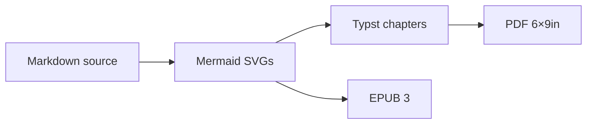

# The Example Book

This paragraph lives before the first part, so it becomes the **preamble** — the
pipeline titles it with `preambleTitle` from `book.config.json` ("Introduction"
here). Everything you see in this file maps one-to-one to a feature of the
engine: heading hierarchy, inline formatting, tables, diagrams, math, and
worksheets.

Inline formatting survives the trip to both targets: **bold**, *italic*,
`inline code`, ~~strikethrough~~, and [links](https://github.com/felipefontoura/book-kit).

# PART I: The Basics

## Chapter 1: Structure and Formatting

A part divider is an H1 starting with `PART` + roman numeral. A chapter is an H2
in the exact form `Chapter N: Title`. Everything else nests below.

### Sections are H3

Body text is plain Markdown paragraphs. Lists work as expected:

- Unordered lists use hyphens
- They can hold **bold** and `code`
- And wrap across lines without breaking the print layout

1. Ordered lists use numbers
2. The template styles the counters

### Tables

GFM pipe tables become print-ruled tables (thin bottom rules, no full grid):

| Element | Markdown | Rendered as |
|---|---|---|
| Part | `# PART I: Title` | full-page part divider |
| Chapter | `## Chapter 1: Title` | numbered chapter opening |
| Appendix | `## Appendix A: Title` | lettered appendix |

### Blockquotes and code

> A blockquote gets the amber left bar — separation by surface, not by border.

```bash
# Fenced code keeps its language hint and gets a tinted background
bash kit/scripts/build.sh --all
```

### Diagrams

Diagrams are always Mermaid — rendered to hand-drawn-style SVGs at build time
and embedded in both the PDF and the EPUB. The kit injects the Kit palette
automatically, plus four semantic node classes you can use with zero setup:
`accent`, `soft`, `neutral`, and `muted`. A book can add its own classes in a
`mermaid.classes.mmd` file at the book root.



## Chapter 2: Math and Worksheets

### Equations

Math is authored in LaTeX once and feeds both targets — Typst via `mitex` for
the PDF, KaTeX → MathML for the EPUB. A display equation sits on its own block
between double-dollar delimiters:

$$\text{Value} = \sum_{t=1}^{\infty}\frac{\text{FCF}_t}{(1+r)^t} = \frac{\text{FCF}}{r-g}$$

Inline math is wrapped in backslash-parenthesis delimiters: the discount factor
\(\frac{1}{(1+r)^t}\) shrinks future cash flows. A single dollar sign is
**not** a math delimiter — it stays currency, so $300,000 and $5 million read
as prose.

### Worksheets

A fenced block with the `worksheet` language hint renders as a filled
diagnostic form — mono labels, hand-written-style values that wrap instead of
clipping:

```worksheet
title: Client diagnostic — example
section: Current state
Revenue | $2.4M / year, flat for 3 years
Bottleneck | Lead qualification is 100% manual
section: Target state
Automation | Qualification triaged by an LLM pipeline
note: Fill one of these per discovery call.
```

## Appendix A: Cheat Sheet

An appendix is an H2 in the form `Appendix A: Title` — uppercase letter, colon.
It is numbered by letter and listed after the parts in the table of contents.
